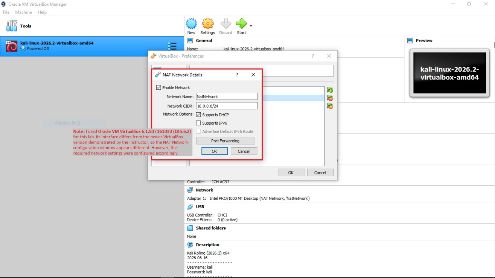
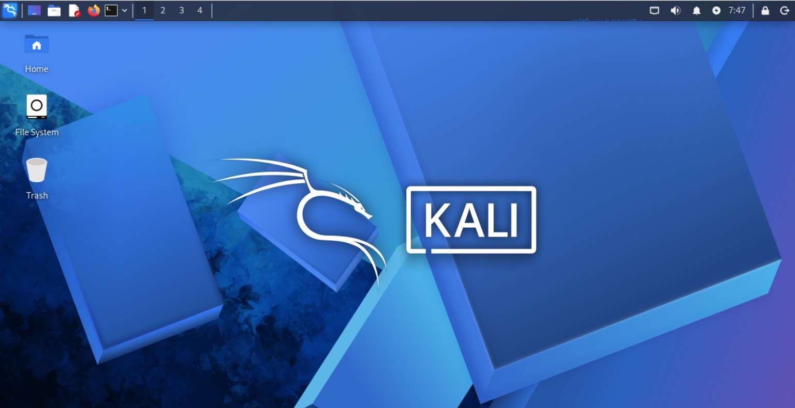
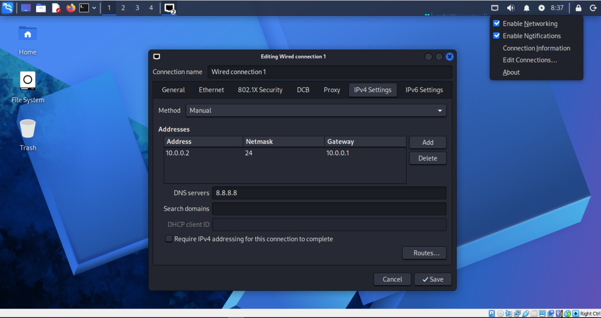

<h1 align="center">🔐 Cybersecurity Lab Environment Setup</h1>

  

  

  

  

  

   

  

  

  

 

  
---

## 📌 Project Overview

This project documents the setup of a virtual cybersecurity laboratory as part of my Week 1 project for the Networkwalks Cybersecurity Internship.

The lab was built using Oracle VM VirtualBox and Kali Linux to provide a controlled environment for hands-on cybersecurity learning and authorized security testing. A custom NAT Network was configured to provide network connectivity for the Kali Linux virtual machine and to support additional virtual machines in future lab exercises.

---

## 🎯 Objectives

The objectives of this lab are to:

- Set up Oracle VM VirtualBox as the virtualization platform.
- Import and configure Kali Linux as a virtual machine.
- Create and configure a custom NAT Network.
- Configure Kali Linux to use the virtual network.
- Prepare a controlled virtual environment for hands-on cybersecurity practice.
- Document the lab setup, configuration, and troubleshooting process.
- Prepare the environment for future cybersecurity exercises.

---

## 🛡️ Purpose of the Lab

The purpose of this lab is to provide a controlled virtual environment for hands-on cybersecurity practice while reducing the risk of affecting the host system or unauthorized external systems.
The lab environment can support activities such as:

- Network reconnaissance and scanning.
- Vulnerability assessment.
- Packet and network traffic analysis.
- Security tool experimentation.
- Web security testing.
- Authorized penetration testing exercises.
- Future cybersecurity projects involving additional virtual machines.

⚠️ Ethical Use: All cybersecurity activities performed in this lab should be limited to systems and environments that are personally owned or explicitly authorized for testing.

---

## 🏗️ Lab Architecture

The current lab environment consists of a Windows 10 host system running Oracle VM VirtualBox, with Kali Linux deployed as the primary cybersecurity virtual machine.

The virtual machine is connected through a custom NAT Network configured with the 10.0.0.0/24 network range.

  <strong>Windows 10 Host</strong> 
  │ 
  ▼ 
  <strong>Oracle VM VirtualBox 6.1.50</strong> 
  │ 
  ▼ 
  <strong>Custom NAT Network</strong> 
  10.0.0.0/24 
  │ 
  ▼ 
  <strong>Kali Linux 2026.2</strong>

---

## ⚙️ Lab Configuration

| Component | Configuration |
|---|---|
| Host Operating System | Windows 10 |
| Virtualization Platform | Oracle VM VirtualBox 6.1.50 r161033 (Qt5.6.2) |
| Security Operating System | Kali Linux 2026.2 |
| Virtual Network Type | NAT Network |
| Network Name | NatNetwork |
| Network Address | 10.0.0.0/24 |
| Kali Linux IP Address | 10.0.0.2/24 |
| Default Gateway | 10.0.0.1 |
| DNS Server | 8.8.8.8 |
| DHCP | Enabled |
| IPv6 | Disabled |

> Note: I used Oracle VM VirtualBox 6.1.50 r161033 (Qt5.6.2) for this lab. Its interface differs from the newer VirtualBox version demonstrated by the instructor, so the NAT Network configuration window appears different. However, the required network settings were configured accordingly.

---

## 🧾 Lab Setup Procedure

### Step 1: Set Up Oracle VM VirtualBox
Oracle VM VirtualBox was used as the virtualization platform for the cybersecurity lab. Due to compatibility differences with the host system, Oracle VM VirtualBox 6.1.50 r161033 (Qt5.6.2) was used for the setup.

### Step 2: Import Kali Linux
The Kali Linux 2026.2 prebuilt VirtualBox image was imported into VirtualBox and configured as the primary cybersecurity virtual machine for the lab.

### Step 3: Configure the NAT Network
A custom NAT Network was created in VirtualBox to provide network connectivity for the virtual lab.
The NAT Network was configured with the following settings:
- **Network Name:** NatNetwork
- **Network CIDR:** 10.0.0.0/24
- **DHCP:** Enabled
- **IPv6:** Disabled

This configuration allows the Kali Linux virtual machine to use the virtual network and provides a network structure that can accommodate additional virtual machines in future lab exercises.

### Step 4: Start and Verify Kali Linux

After the Kali Linux virtual machine was imported and connected to the custom NAT Network, the virtual machine was started successfully in VirtualBox.

The successful boot confirmed that Kali Linux was operational and ready for the next stage of the lab setup: network configuration.

### Step 5: Configure Kali Linux Network

The Kali Linux network interface was then configured manually with a static IPv4 address to provide a consistent network configuration within the virtual lab.

The following network settings were applied:

- **IPv4 Method:** Manual
- **IP Address:** 10.0.0.2
- **Prefix:** /24
- **Default Gateway:** 10.0.0.1
- **DNS Server:** 8.8.8.8

Using a static IP address ensures that the Kali Linux virtual machine maintains a predictable address within the lab network.

---

## ✅ Setup Status

The core cybersecurity lab environment was successfully set up and configured. The completed setup includes:

- Oracle VM VirtualBox 6.1.50 as the virtualization platform.
- Kali Linux 2026.2 imported and successfully started.
- A custom NAT Network configured with the `10.0.0.0/24` network range.
- Kali Linux configured with the static IP address `10.0.0.2/24`.
- Default gateway configured as `10.0.0.1`.
- DNS server configured as `8.8.8.8`.
  
The configuration screenshots included in this repository document the completed lab setup.
---

 

  <code>──|END OF LAB DOCUMENTATION|──</code>

  🔐 <strong>Cybersecurity Lab Environment</strong> • Networkwalks

  Documented by Jeremiah Glory

